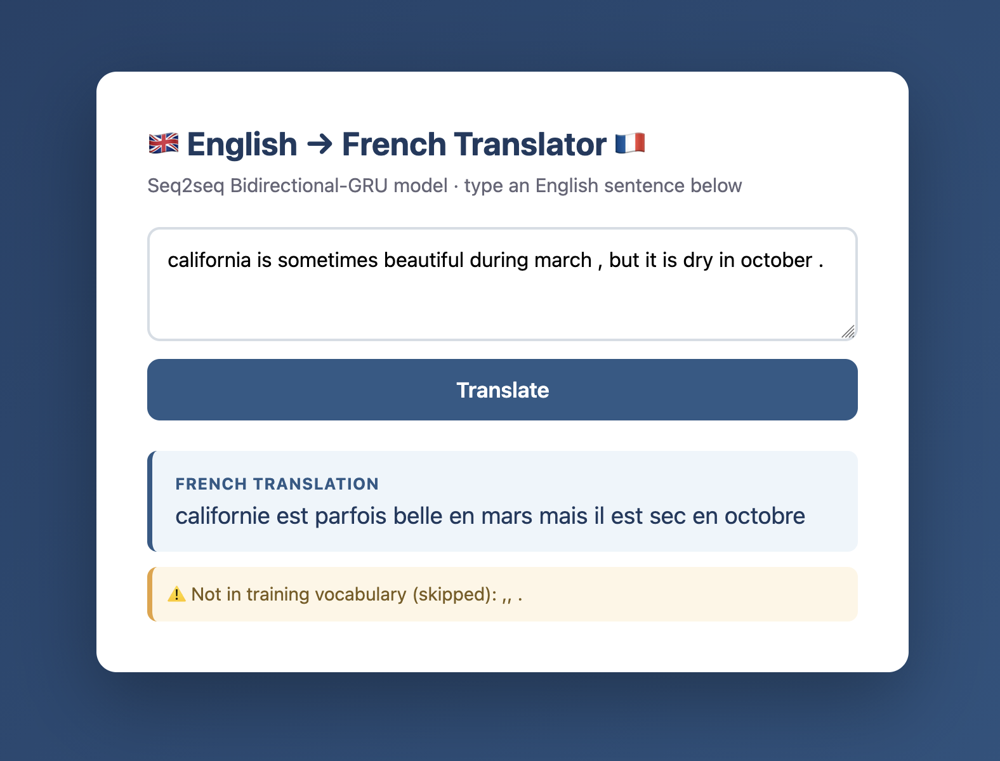

# 🇬🇧 → 🇫🇷 English–French Neural Machine Translation


A web app that translates simple English sentences into French using a sequence-to-sequence
**Bidirectional GRU** model built with TensorFlow/Keras, served with **Flask**, containerized
with **Docker**, and deployed on **Google Cloud Run**.

**Live demo:** https://en-fr-translator-297513110687.us-central1.run.app

## Preview



## What the model does

Given an English sentence, the model outputs the French translation word by word. It was
trained on the ZAKA AI EN/FR parallel corpus: **137,860 aligned sentence pairs** with a small
vocabulary (~227 English / ~354 French words) covering weather, months, fruits, and animals.

Architecture:

```
Embedding (256) → Bidirectional GRU (256) → RepeatVector (23)
→ Bidirectional GRU (256, return_sequences) → TimeDistributed Dense (softmax)
```

Trained for 10 epochs with sparse categorical cross-entropy and Adam, reaching
**~95% validation accuracy**. Sentences are padded to 23 tokens.

Example translations:

| English | French (model output) |
|---|---|
| paris is never freezing during winter , but it is wonderful in spring . | paris ne gèle jamais en hiver mais c'est merveilleux au printemps |
| she likes the little red car . | elle aime la petite voiture rouge |
| the elephant is the biggest animal . | l'éléphant est le plus gros animal |

## How to use the interface

1. Open the [live demo](https://en-fr-translator-297513110687.us-central1.run.app) (or run it locally, below).
2. Type an English sentence in the text box — lowercase, simple vocabulary works best
   (weather, months, fruits, animals, colors).
3. Click **Translate**. The French translation appears below the form.
4. If your sentence contains words the model never saw during training, a yellow warning
   lists them — those words are skipped, not translated.

## Run locally with Docker (recommended)

Prerequisite: [Docker Desktop](https://www.docker.com/products/docker-desktop/) installed.

```bash
git clone https://github.com/zalahbabi/en-fr-translator.git
cd en-fr-translator
docker build -t en-fr-translator .
docker run -p 7860:7860 en-fr-translator
```

Then open **http://localhost:7860** in your browser.

> **Apple Silicon note:** `tensorflow-cpu` has no Linux arm64 wheels. On an M-series Mac,
> either swap `tensorflow-cpu` for `tensorflow` in `requirements.txt`, or build with
> `docker build --platform linux/amd64 -t en-fr-translator .`

## Run locally without Docker

```bash
git clone https://github.com/zalahbabi/en-fr-translator.git
cd en-fr-translator
python -m venv venv && source venv/bin/activate
pip install -r requirements.txt
python app.py
# open http://localhost:7860
```

## Deploy to Google Cloud Run

```bash
gcloud services enable run.googleapis.com cloudbuild.googleapis.com artifactregistry.googleapis.com
gcloud run deploy en-fr-translator \
  --source . \
  --region us-central1 \
  --allow-unauthenticated \
  --memory 2Gi \
  --timeout 300
```

Cloud Build builds the Dockerfile remotely and prints the public Service URL.
The Dockerfile binds gunicorn to `$PORT`, which Cloud Run injects automatically.

## Project structure

```
.
├── app.py                  # Flask app: loads model + tokenizers, serves UI and /health
├── templates/
│   └── index.html          # Web interface (HTML/CSS)
├── model/
│   ├── translator.keras    # Trained seq2seq model
│   ├── english_tokenizer.pkl
│   └── french_tokenizer.pkl
├── docs/
│   └── screenshot.png      # App preview
├── requirements.txt
├── Dockerfile
└── save_for_deployment.py  # Run in the training notebook to export model/ files
```

## API

| Route | Method | Description |
|---|---|---|
| `/` | GET | Web UI |
| `/` | POST | Form field `sentence` → rendered translation |
| `/health` | GET | Returns `{"status": "ok"}` (liveness check) |

## Known issues & limitations

- **Limited vocabulary**: only ~227 English words from the training corpus are understood;
  anything else is skipped (the UI warns you which words were ignored).
- **Pattern bias**: rare sentence types (e.g. animal sentences) sometimes borrow phrasing
  from the dominant weather-sentence patterns; occasional repeated words ("est le le").
- **Cold starts**: the free Cloud Run tier scales to zero, so the first request after idle
  takes ~30–60 s.
- **Future improvements**: attention mechanism, more training epochs, BLEU-score
  evaluation, or a Transformer architecture.

## Acknowledgments

Built as the final deployment project for the ZAKA AI Machine Learning Certification.
Dataset provided by ZAKA AI.
